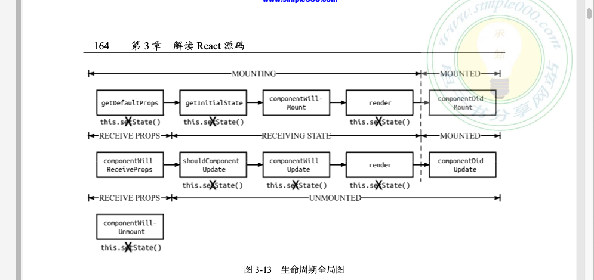
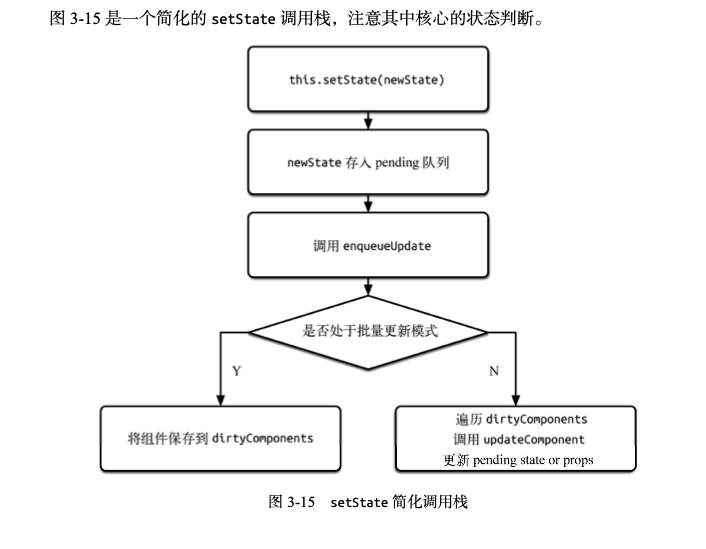
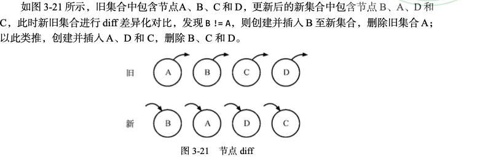

#### react

##### react 底层概念

1.  **事件系统**

- 合成事件绑定方式

  - 借鉴了原生 DOM0 事件实现方式而已

  ```
  //原生dom0事件
  <div onclick="clickFunc()"></div>

  // react合成事件
  <div onClick={this.clickFunc}></div>
  ```

- 合成事件实现机制：事件委托和自动绑定
  - **事件委派**
    1. 事件代理机制
    2. 不会直接绑定到真实的节点，将事件绑定到最外层的结构，使用一个统一事件监听处理
    3. 组件挂载或者卸载，会统一在事件监听器删除或者插入
    4. 事件发生，在这个统一事件监听器处理，后映射到真正的事件处理函数，并且调用
    5. 总结：简化事件处理和回收机制，提升效率
  - **自动绑定**：在 es6 和纯函数里自动绑定消失，需要手动绑定
    1. bind 绑定方法
    2. 构造器生命
    3. 箭头函数
- 合成事件与原生事件避免混用,可以通过 e.target 来避免
- 合成事件与原生事件的对比
  - 事件传播与阻止事件传播
    1. 事件传播只实现事件冒泡，未实现捕获
    2. 阻止事件，e.preventDefault()即可
  - 事件类型：合成事件是原生事件的子集
  - 事件绑定
  - 事件对象：不存在兼容性问题，在事件处理函数中可以合成一个事件对象。

2. **表单**

- 受控组件：组件发生变化都写入到 state 里去
- 非受控组件：表单组件没有 value props，不受 state 和 props 控制，一般通过 ref prop 去获取 dom 元素

3. **组件通信**

- 没有嵌套关系组件通信，可以引入 node.js events 模块实现浏览器版

4. **组件间抽象**

- mixin
  - mixin 封装方法:实现多重类继承
  ```
    const mixin = function(obj, mixins) {
        const newObj = obj;
        newObj.prototype = Object.create(obj.prototype);
        for (let prop in mixins) {
        if (mixins.hasOwnProperty(prop)) {
        newObj.prototype[prop] = mixins[prop]; }
        }
        return newObj;
    }
    const BigMixin = {
        fly: () => {
        console.log('I can fly');
        }
    };
    const Big = function() {
        console.log('new big');
    }
    mixin(BigMixin, Big)
  ```
  - 缺陷： 1.破坏原有组件的封装 2.命名冲突 3.增加复杂性
- 高阶组件
  - 定义： 输入一个组件，输出一个新组件
  - 实现方法：属性代理和反向继承
  1. 属性代理：包裹组件操作 props
  ```
    import React, { Component } from 'React';
    const MyContainer = (WrappedComponent) => class extends Component {
    render() {
        return <WrappedComponent {...this.props} />;
    } }
  ```
  2. 反向代理：高阶组件继承被包裹的组件
     渲染劫持：控制 wrappedComponent 的渲染过程，并渲染各种各样的结果。
     控制 state
- 组合式组件开发实践
  1. 组件再分离
  2. 逻辑再抽象
- 组件性能优化
  1. 纯函数： - 给定相同输入，产生相同的输出 - 过程没有副作用:不能改变外部的状态(列如：函数内部对象或者数组，函数内部改变对象或者数组，引起外部对象或者数组的变化) - 没有额外的状态依赖：方法内的状态只在方法的生命周期内存活。
     2.pureRender
     - 本质：重新实现了 shouldComponentUpdate 生命周期的方法，让传入的 props 和 state 的类型，与之前做浅比较。如果返回 false，不会执行 render。
     - 运用：
     ```
       import React, { Component } from 'react';
       import PureRenderMixin from 'react-addons-pure-render-mixin';
       class App extends Component {
         constructor(props) {
           super(props);
         this.shouldComponentUpdate =  PureRenderMixin.shouldComponentUpdate.bind(this);
         }
         render() {
           return <div className={this.props.className}>foo</div>;
       }
       }
     ```
  2. 优化 pureRender
     **注：** pureRender 是浅比较带来应用场景并不多，深比较带来性能成本比较昂贵，如：shouldComponentUpdate;为了解决浅比较带来的问题，下面提供几种优化方案：
     - **直接为 props 设置对象或者对象**
       **注：** 每次创建组件实例，传入对象或者数组值没有发生变化，它的引用地址也会发生变化
     - **设置 props 方法并通过事件绑定在元素上**
       **注：** 构造器内绑定方法，不用每次进行事件。现在箭头函数很好解决这个问题。
     - **设置子组件**
       **注：** 在子组件设置 pureRender,利用 pureRender 浅比较的性能，以期不被影响。
  3. immutable
     **注：** 数据传递时，进行组件性能优化。对象时等引用类型赋值，新值改变容易影响原来对象的变化，而深拷贝是一个解决方案，当然也会带来性能的内存的浪费。
     - Immutable Data
       **注：** 结构共享:就是对象树中一个节点发生变化，只改变这个节点和受它影响的父节点，其他进行共享。
       Map:键值对集合
       List：有序可重复的列表
       ArraySet:无序不可重复的列表 - 优势
       降低了“可变”带来的复杂度/节省内存/撤销/重做/拥抱函数式编程/并发安全 - 缺陷
       容易与原生对象混淆/很容易忘记赋值
       5.key
       6.react-addons-perf 检测性能优化工具。

4. **react 源码学习**

- virtual DOM
  1.  虚拟 dom 基本元素：标签名/节点属性/子节点/标识 id
  ```
  {
    tagName:'div',//标签名
    properties:{//节点属性
      style:{}
    },
    children:[],//子节点
    key:1//标识
  }
  ```
  2.  react 虚拟 dom 节点 --- reactNode：[ReactElement:[ReactComponentElement, ReactDOMElement],ReactFragment, ReactText]
  3.  创建 React 元素：ReactElement.createElement
  4.  初始化 React 组件：创建组件，先调用 instantiateReactComponent,判断 node 类型来区分组件入口
      - node 不存在，初始化空组件，ReactEmptyComponent.Create()
      - node 是对象类型 Dom 标签是自定义组件
      - node 是数字或者字符串，则初始化 ReactNativeComponent.CreateInstanceForText(node)
      - 否则不处理
  5.  文本组件：ReactDOMTextComponent
  6.  DOM 标签组件:与原生组件名相同，react 不会直接操作原生 dom,既可能保持性能稳定与高效，可以降低直接操作原生 dom 而导致错误的风险
      - 更新属性：通过 createOpenTagMarkupAndPutListeners 来处理 DOM 节点属性和事件
      - 更新子节点：\_createContentMarkup (transaction, props, context) 来处理节点的内容， mountChildren 来对子节点进行初始化渲染
  7.  自定义组件
- 生命周期 1.初探生命周期：

  - 首次挂载组件：getDefaultProps、getInitialState、componentWillMount、 render 和 componentDidMount。
  - 卸载： componentWillUnmount
  - 重新挂载：getInitialState、componentWillMount、render 和 componentDidMount，但并不执行 getDefaultProps
  - 再次渲染：componentWillReceiveProps、shouldComponentUpdate、componentWillUpdate、render 和 componentDidUpdate

    2.详解生命周期：
    **注：** getDefaultProps 是通过构造函数进行管理的

  - mountComponent(挂载), updateComponent(接受数据更新组件),unmountComponent(卸载组件)
  - mounting:初始化 state， componentWillMount render componentDidMount，render 它是通过递归渲染内容
  - RECEIVE_PROPS(updateComponent):componentWillReceiveProps、shouldComponent-Update、componentWillUpdate、render 和 componentDidUpdate, 更新组件也是通过递归渲染的
  - UNMOUNTING：componentWillUnmount/如果存在 componentWillUnmount，则执行并重置所有相关参数、更新队列以及更新状态，如 果此时在 componentWillUnmount 中调用 setState，是不会触发 re-render 的，这是因为所有更新 队列和更新状态都被重置为 null，并清除了公共类，完成了组件卸载操作。
    

- setState 机制
  **注：** 异步更新机制，当执行 setState 时，会将更新的 state 合并后放入到队列，并不会立刻更新 this.state,通过队列机制进行批量更新 state。通过状态列队机制实现 setState 异步更新。避免频繁更新 state；
  
  - setState 是通过队列机制实现 异步更新 state；
  - setState 实际是执行 enqueueSetState 方法，对 partialState 和 pendingStateQueue 更新队列进行合并操作，最后通过 enqueueUpdate 执行 state 更新；
- diff 算法
  1.diff 策略：ui 中的 dom 节点跨层级移动操作特别少；拥有同类型组件生成相似的树形结构，不同类生成不同类的树形结构；对于同一层级一组子节点通过唯一 id 进行区分。进行 tree diff --- component diff ---- element diff

2. tree diff: 树进行分层比较
   
3. component diff:
   - 判断组件类型，同类型按原策略进行比较虚拟 dom
   - 不是同类型组件，判断为 dirtyComponent, 替换整个组件下所有子节点
   - 对于同一类型的组件，有可能其 Virtual DOM 没有任何变化，如果能够确切知道这点，那么就可以节省大量的 diff 运算时间。因此，React 允许用户通过 shouldComponentUpdate() 来判断该组件是否需要进行 diff 算法分析
     
4. element diff
   - 插入，移动与删除
   - INSERT_MARKUP:新的组件类型不在旧集合里，即全新节点.
   - MOVE_EXISTING:旧集合中有新组件类型，且 element 是可更新的类型，generateComponent- Children 已调用 receiveComponent，这种情况下 prevChild=nextChild，就需要做移动操作，可以复用以前的 DOM 节点.
   - REMOVE_NODE:旧组件类型，在新集合里也有，但对应的 element 不同则不能直接复用和更新，需要执行删除操作，或者旧组件不在新集合里的，也需要执行删除操作
     
     5.diff 算法运作：对新集合遍历-->通过 key 判断新旧集合是否存在相同节点————>存在，进行移动在进行位置是否执行该操作。

- react patch 方法：是将虚拟 dom 转换成真实 dom 的方法；通过遍历差异列队实现的。遍历差异列队进行相应的操作，插入删除等。

- flux 架构:逻辑和数据永远单向流动；

  - mvc/mvvm 架构：

    1. mvc:将 model（数据）和 view（界面）隔离开，通过 controller(控制层)管理数据逻辑和用户页面输入，进行一个协调作用。
       ```mermaid
          graph LR
          a[view]--用户输入-->b(controller)
          b--改变-->c(model)
          c--告知监听器-->a
          b--响应-->a
          a--监听-->c
       ```

    ```

    ```

  2. mvvm：双向数据绑定，view, viewModel 代替了 controller, model
  3. flux 数据模型
     

- redux 架构：单向数据流动
  - 工作方式： action（用户动作值）通过 store.dispatch 修改 state 值；state 值或者 action 值通过 reducer 确定修改状态的值，store 根据 reducer 的 creteStore 方法创建的；
    
  - redux 设计原则：
    1. 单向数据流
    2. 状态只读，不是直接修改 state，通过 store。dispatch 修改状态
    3. reducer 纯函数
  - 核心的 APi-createStore
    1. getState():获取 store 状态
    2. dispatch:分发 action，返回 action，修改 store 数据的唯一方式
    3. subscribe:监听 store 发生变化。
  - 绑定 react:react-redux
    1. render props 组件：Provider----接受 store 为 props，顶层组件应用
    2. 高阶组件:connect--使得组件获取 store 数据
       **总结：**所述 react-redux 是一个同步的数据流动方式
  - redux 实现异步数据流：
    1. middleware 为了增强 redux 诞生
    2. middleware 机制：redux 之 applyMiddleWare
    - 函数式编程思维
    - 给 middleWare 分发 store
    3. redux-thunk
  - sdf
